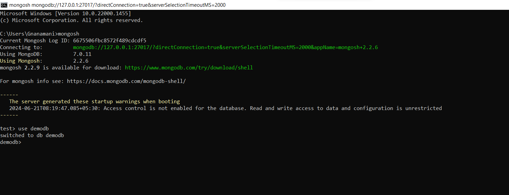
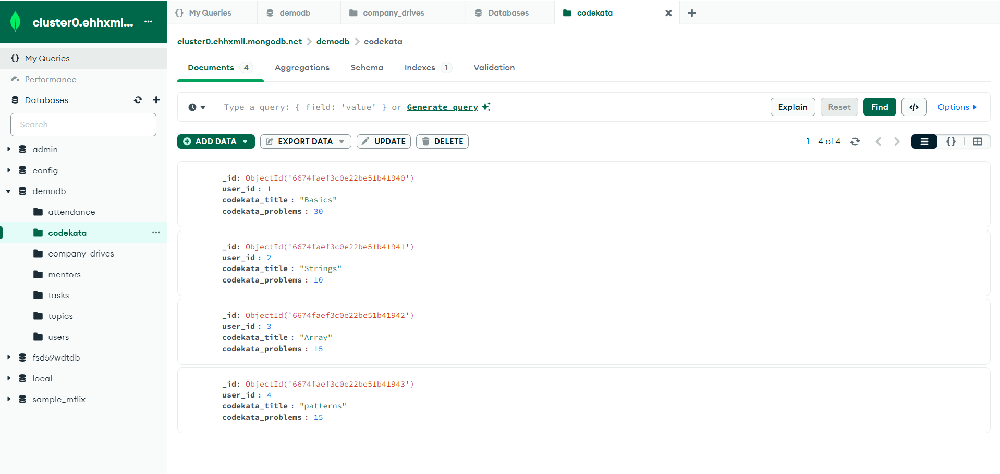
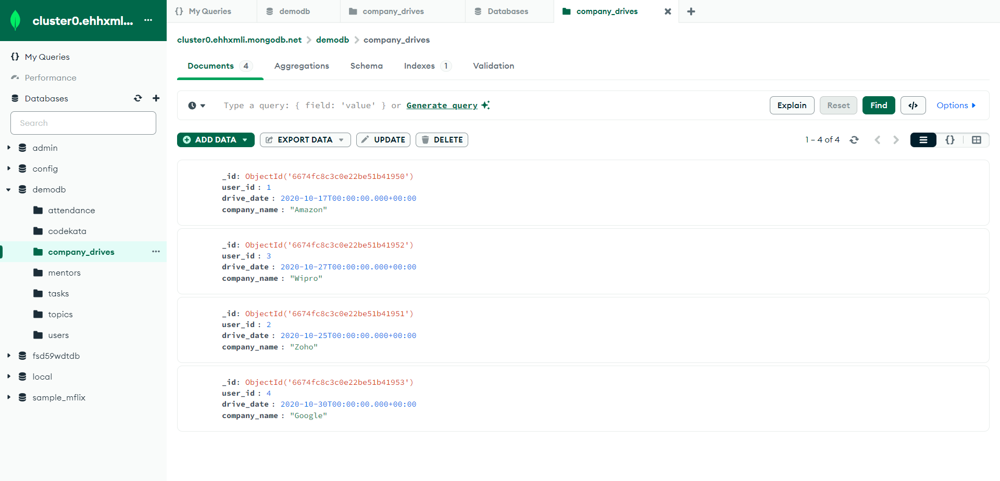
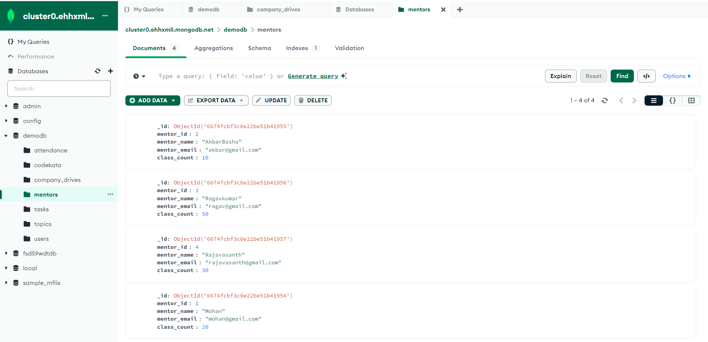
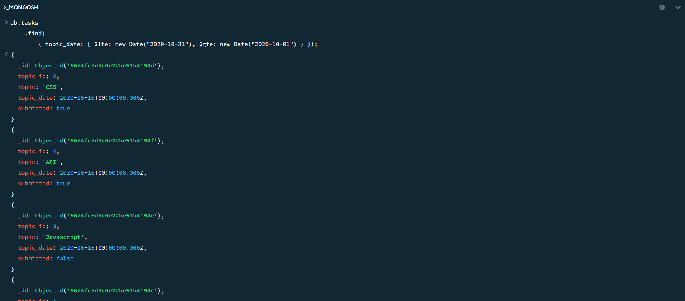
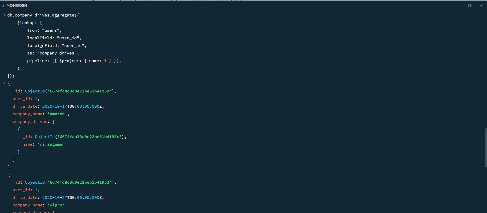
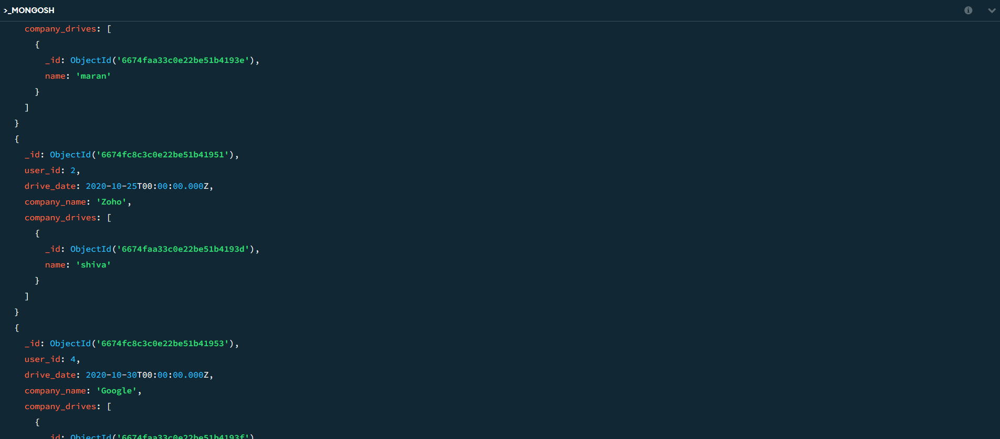

1. // To create Database

   // use demodb

  - 

2. // To create and insert data for user

db.users.insertMany([
    {
        user_id: 1,
        name: "ms.sugumar",
        email: "sugu@gmail.com",
    },
    {
        user_id: 2,
        name: "shiva",
        email: "shiva@gmail.com",
    },
    {
        user_id: 3,
        name: "maran",
        email: "maran@gmail.com",
    },
    {
        user_id: 4,
        name: "jaya",
        email: "jaya@gmail.com",
    },
]);

- 

3. // To create and insert data for codekata

db.codekata.insertMany([
    {
        user_id: 1,
        codekata_title: "Basics",
        codekata_problems: 30,
    },
    {
        user_id: 2,
        codekata_title: "Strings",
        codekata_problems: 10,
    },
    {
        user_id: 3,
        codekata_title: "Array",
        codekata_problems: 15,
    },
    {
        user_id: 4,
        codekata_title: "patterns",
        codekata_problems: 15,
    },
]);

- 

4. // To create and insert data for attendance

db.attendance.insertMany([
    {
        user_id: 1,
        topic_id: 1,
        present: true,
    },

    {
        user_id: 2,
        topic_id: 2,
        present: true,
    },
    {
        user_id: 3,
        topic_id: 3,
        present: false,
    },
    {
        user_id: 4,
        topic_id: 4,
        present: true,
    },
]);

- 

5. // To create and insert data for topics

db.topics.insertMany([
    {
        topic_id: 1,
        topic: "React",
        topic_created: new Date("2020-10-10"),
    },
    {
        topic_id: 2,
        topic: "MongoDB",
        topic_created: new Date("2020-10-25"),
    },
    {
        topic_id: 3,
        topic: "Nodejs",
        topic_created: new Date("2020-11-05"),
    },
    {
        topic_id: 4,
        topic: "API",
        topic_created: new Date("2020-11-07"),
    },
]);

- 

6. // To create and insert data for task

db.tasks.insertMany([
    {
        topic_id: 1,
        topic: "HTML",
        topic_date: new Date("2020-10-01"),
        submitted: true,
    },
    {
        topic_id: 2,
        topic: "CSS",
        topic_date: new Date("2020-10-10"),
        submitted: true,
    },
    {
        topic_id: 3,
        topic: "Javascript",
        topic_date: new Date("2020-10-16"),
        submitted: false,
    },
    {
        topic_id: 4,
        topic: "API",
        topic_date: new Date("2020-10-16"),
        submitted: true,
    },
]);

- 

7. // To create and insert data for companydrive

db.company_drives.insertMany([
    {
        user_id: 1,
        drive_date: new Date("2020-10-17"),
        company_name: "Amazon",
    },
    {
        user_id: 2,
        drive_date: new Date("2020-10-25"),
        company_name: "Zoho",
    },
    {
        user_id: 3,
        drive_date: new Date("2020-10-27"),
        company_name: "Wipro",
    },
    {
        user_id: 4,
        drive_date: new Date("2020-10-30"),
        company_name: "Google",
    },
]);

- 

8. // To create and insert data for mentors

db.mentors.insertMany([
    {
        mentor_id: 1,
        mentor_name: "Mohan",
        mentor_email: "mohan@gmail.com",
        class_count: 20,
    },
    {
        mentor_id: 2,
        mentor_name: "AkbarBasha",
        mentor_email: "akbar@gmail.com",
        class_count: 10,
    },
    {
        mentor_id: 3,
        mentor_name: "Ragavkumar",
        mentor_email: "ragav@gmail.com",
        class_count: 50,
    },
    {
        mentor_id: 4,
        mentor_name: "Rajavasanth",
        mentor_email: "rajavasanth@gmail.com",
        class_count: 30,
    },
]);

- 

--**Questions and answer**--
1. // Find all the topics and tasks which are thought in the month of October

db.tasks
    .find(
        { topic_date: { $lte: new Date("2020-10-31"), $gte: new Date("2020-10-01") } });

- 

db.topics
    .find({ topic_created: { $lte: new Date("2020-10-31"), $gte: new Date("2020-10-01") } });

-     

2. // Find all the company drives which appeared between 15 oct-2020 and 31-oct-2020

db.company_drives
    .find({ drive_date: { $lte: new Date("2020-10-31"), $gte: new Date("2020-10-15") } });

-     

3. // Find all the company drives and students who are appeared for the placement.

db.company_drives.aggregate({
    $lookup: {
        from: "users",
        localField: "user_id",
        foreignField: "user_id",
        as: "company_drives",
        pipeline: [{ $project: { name: 1 } }],
    },
});

- 
- 

4. // Find the number of problems solved by the user in codekata

db.users.aggregate({
    $lookup: {
        from: "codekata",
        localField: "user_id",
        foreignField: "user_id",
        as: "Solved",
        pipeline: [{ $project: { codekata_problems: 1 } }],
    },
});

- 
- 

5. // Find all the mentors with who has the mentee's count more than 15

db.mentors.find({ class_count: { $gt: 15 } });

- 

6. // Find the number of users who are absent and task is not submitted between 15 oct-2020 and 31-oct-2020(from and foreignField as same db collection )

db.tasks
    .aggregate([
        {
            $lookup: {
                from: "attendance",
                localField: "topic_id",
                foreignField: "user_id",
                as: "attendance",
            },
        },
        {
            $match: { $and: [{ submitted: false }, { "attendance.present": false }] },
        },
    ]);

- 